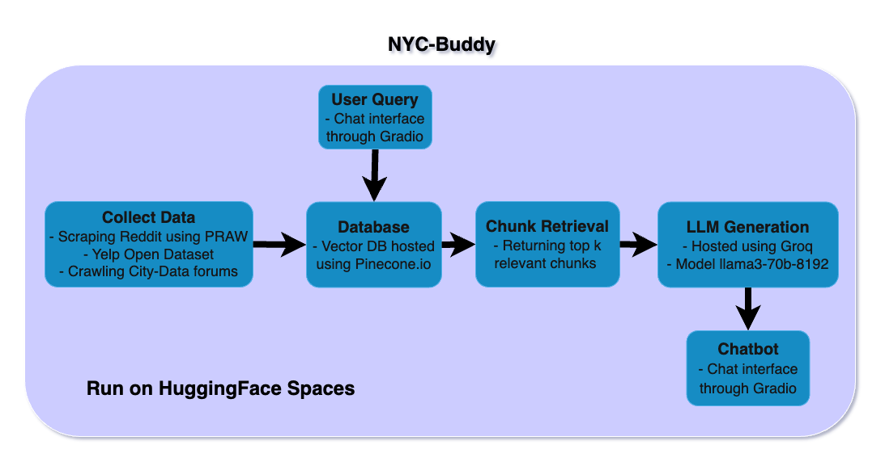

# RAG Chatbot with Groq & Pinecone

This repository contains a chatbot application that leverages Retrieval-Augmented Generation (RAG) for enhanced conversational abilities. The project uses Groq for model inference, Pinecone as the vector database for storing and retrieving document embeddings, and is deployed on HuggingFace Spaces for easy access and demonstration.

A live demo can be found here: https://huggingface.co/spaces/mt3842ml/NYC-Buddy

## Overview

NYC Buddy is a chatbot designed to provide personalized recommendations for users asking about New York City related questions. The chatbot utilized RAG on similar forum queries, where real people give recommendations. This is leveraged to give the bot more context on recommendations, rather than just the first few results on a google search. It allows for insightful suggestions on more niche and local spots that may not have normally been recommended by a standard LLM. 

The key components of the project include:

- **Groq Inference:** Utilizes Groq's API to generate chat completions using a state-of-the-art model (`llama3-70b-8192`).
- **HuggingFace Encoder:** Uses the `dwzhu/e5-base-4k` model for converting text into embeddings.
- **Pinecone Vector Database:** Stores document embeddings and allows for efficient similarity searches to retrieve context.
- **HuggingFace Spaces and Gradio UI:** Built with Gradio and hosted on HuggingFace Spaces, offering an easy setup and user-friendly conversation experience.

## How It Works

### Data Collection
The application collects and processes public data using PRAW (Python Reddit API Wrapper) to retrieve relevant discussions and insights from Reddit. This allows it to integrate up-to-date, community-driven knowledge into its responses. The scraped text is then cleaned, preprocessed, and converted into vector embeddings. Currently, it contains around 2000 posts. Future iterations of this chatbot will incorporate more data from additional sources, such as news articles and other online forums. This will improve response accuracy and ensure broader, more diverse contextual understanding.

### Embedding Generation
The application uses the HuggingFace encoder `dwzhu/e5-base-4k` to convert text into embeddings. These embeddings capture semantic meaning and are stored in Pinecone for compact yet fast retrieval. This allows the chatbot to access relevant past information efficiently.

### Context Retrieval
When a user inputs a query, the system encodes it and searches the Pinecone index for the most semantically similar content snippets. These retrieved snippets provide additional context for the response generation process, providing that answers are accurate and context-aware.

### Response Generation
The user’s query, along with the retrieved contextual information, is sent to Groq’s inference API. The large language model (`llama3-70b-8192`) processes the information and generates a response based on both the query and the additional context.

### Interactive UI
The chatbot interface is built using Gradio for an intuitive user experience. The chat interface presents a familiar chat design, making interactions smooth and visually appealing.

## Deployment
This project is hosted on HuggingFace Spaces, which allows easy deployment and access. Spaces provides a free and efficient way to run this AI application in a web environment without requiring any infrastructure.

## Requirements
This application requires a free [Groq](https://www.groq.com) API key for the inference engine, and a free [Pinecone](https://www.pinecone.io) API key for the vector database services. 

## Future Enhancements

- **Larger Database:** Collect more data from various sources, adding more context to the knowledge base.
- **Improved Context Management:** Enhance the document retrieval process to better capture long conversations.
- **User Customization:** Allow users to modify system prompts and context handling dynamically.

## License

This project is licensed under the [MIT License](LICENSE).

## Acknowledgements
This project is based on an example provided by [Pinecone](https://github.com/pinecone-io/examples/blob/master/integrations/groq/groq-llama-3-rag.ipynb).
